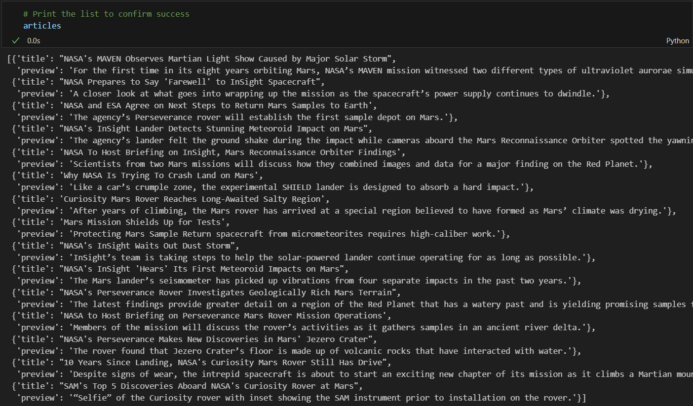

# Web Scraping Assignment

## Part 1 (Mars News)
Below you can see a list of dictionaries with scraped titles and previews of articles on <a href='https://static.bc-edx.com/data/web/mars_news/index.html'>Mars News</a>:
 

## Part 2 (Mars Weather)
According to the data I scraped from <a href='https://static.bc-edx.com/data/web/mars_facts/temperature.html'>Mars Temperature Data Site</a>, there are 12 months on Mars. The data provides information for 1867 sols (Martian days):
 

 Below you can see graphs for average minimum temperature on Mars:
 
 
 As we can see, the 3rd month has the lowest average min temperatures, and the 8th month has the highest average min temperatures.

 Below you can see graphs for average pressure on Mars:
 
 
  As we can see, the 6th month has the lowest average pressure, while the 9th month has the highest average pressure.

 Below you can see the graph that shows the daily minimum temperature of each observation in the data set:
 
  As we can see, the distance both between highest and lowest peaks is roughly 650 (750-100 and 1125-475).
  As can be seen on <a href='https://science.nasa.gov/mars/facts/'>NASA website</a>, a year on Mars lasts 669.6 sols, which is the same as 687 Earth days.
